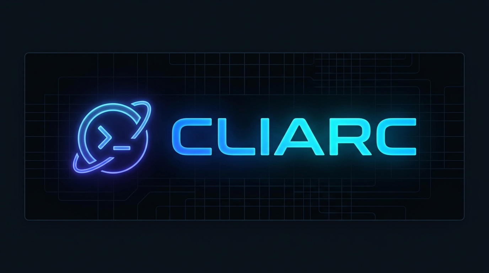

<p align="center">
  
</p>

<h1 align="center">
  Hi  &nbsp;My name is CLIARC
</h1>

<h3 align="center">Extensible Infrastructure &amp; Developer Platform</h3>

<p align="center">
  Building CLIARC — a powerful, extensible platform that brings servers, infrastructure, developer tools, and AI-powered diagnostics into one unified developer workspace.
</p>

<p align="center">
  <a href="https://cliarc.com" target="_blank">
    
  </a>
  <a href="mailto:support@cliarc.com">
    
  </a>
  <a href="https://github.com/cliarc" target="_blank">
    
  </a>
</p>

---

## 🚀 About CLIARC

> **One Core. Unlimited Possibilities.**

CLIARC is a **plugin-based developer platform** for managing servers, infrastructure, developer tools, and diagnostics through a unified interface. Every capability is delivered as a plugin — communicating over **gRPC** with a language-agnostic protocol, meaning plugins can be written in Go, Python, Node.js, Kotlin, or any language with gRPC support.

```
arc/
├── cliarc/                   → ARC CLI & Core (Pure CLI, No plugins)
│   ├── 🖥️  apps/cli/         → Unified CLI entry point (Cobra)
│   ├── ⚙️  core/             → Plugin lifecycle, events, permissions
│   ├── 📡  protocol/         → gRPC + Protobuf definitions
│   ├── 🧰  sdk/go/           → Go Plugin SDK
│   └── 📚  docs/             → Architecture & plugin development guides
│
└── plugins/                  → ALL Plugins (Standalone repositories)
    └── 🔌  ssh/              → Official SSH diagnostic & management plugin
```

---

## ✨ Key Features

| Feature | Description |
|---|---|
| 🔌 **Plugin-based** | Core functionality extended via multi-language plugins |
| 📡 **gRPC Protocol** | Language-independent communication between Core and plugins |
| 🔒 **Secure by default** | Secret references, permission system, no plaintext logging |
| 🌍 **Cross-platform** | Works on macOS, Linux, and Windows |
| 💥 **Crash resilience** | Auto crash detection & health monitoring for all plugins |
| 🛒 **Marketplace ready** | Manifest extension points built in for future plugin marketplace |

---

## 🛠️ CLI Reference

### 🌐 CLIARC Core
| Command | काम / Description |
|---|---|
| `cliarc version` | CLIARC version & build info |
| `cliarc doctor` | पूरा environment & toolchain check |
| `cliarc config` | configuration manage |
| `cliarc update` | CLIARC self-update |
| `cliarc completion` | shell autocomplete generation |
| `cliarc help` | global command help |

### 🔌 Plugin Development
| Command | काम / Description |
|---|---|
| `cliarc plugin init` | नया plugin बनाना (scaffold template) |
| `cliarc plugin dev` | development/watch mode (auto-rebuild) |
| `cliarc plugin run` | locally run plugin action |
| `cliarc plugin test` | test plugin test suite |
| `cliarc plugin build` | executable native binary बनाना |
| `cliarc plugin package` | distributable `.tar.gz` package |
| `cliarc plugin link` | local CLIARC में जोड़ना (`~/.cliarc/plugins`) |
| `cliarc plugin unlink` | local plugin हटाना |
| `cliarc plugin list` | installed plugins देखना |
| `cliarc plugin info` | plugin details & binary specs |
| `cliarc plugin doctor` | plugin validation & diagnostics |
| `cliarc plugin clean` | build files साफ करना |

### 🖥️ Server Inventory
| Command | काम / Description |
|---|---|
| `cliarc server add` | Server inventory में जोड़ना |
| `cliarc server list` | Configured servers देखना |
| `cliarc server import` | OpenSSH config (`~/.ssh/config`) से import करना |
| `cliarc server remove` | Server हटाना |
| `cliarc use <name>` | Active target server set करना |

> 💡 **Plugins Ecosystem**: All plugins (e.g. `plugins/ssh`) reside in the dedicated `plugins/` directory and are executed via `cliarc plugin run <name> <action>` or linked to `~/.cliarc/plugins`.

---

## 📄 Plugin Manifest (`cliarc.plugin.yaml`)

```yaml
name: my-plugin
version: 0.1.0
description: "High-performance developer tool"
author: "CLIARC Community"
license: "Apache-2.0"
homepage: "https://cliarc.com"
repository: "https://github.com/cliarc/my-plugin"
binary: "bin/cliarc-my-plugin"
platforms:
  - windows
  - linux
  - darwin
architectures:
  - amd64
  - arm64
permissions:
  - my-plugin.run
  - my-plugin.status
dependencies: {}
commands:
  - my-plugin.run
  - my-plugin.status
```

---

## 📁 Standard Plugin Project Structure

```
my-plugin/
│
├── src/
│   └── main.go
├── tests/
│   └── plugin_test.go
│
├── cliarc.plugin.yaml
├── README.md
├── LICENSE
├── CHANGELOG.md
├── .gitignore
├── .cliarcignore
│
├── .github/
│   └── workflows/
│       └── release.yml
│
└── bin/
```

---

## ⚡ Installation & Quick Start

### 🚀 Universal 1-Line Install (Automatic PATH Setup)

#### 🪟 Windows (PowerShell)
```powershell
irm https://raw.githubusercontent.com/cliarc/cliarc/main/scripts/install.ps1 | iex
```

#### 🐧 Linux, 🍏 macOS, 🤖 Android (Termux), & WSL
```bash
curl -fsSL https://raw.githubusercontent.com/cliarc/cliarc/main/scripts/install.sh | bash
```

---

### 🔨 Build & Install from Source

```bash
# Prerequisites: Go 1.22+, make
git clone https://github.com/cliarc/cliarc.git
cd cliarc

# Build CLIARC
make build

# Install globally to system PATH
./scripts/install.sh       # On Linux/macOS/Android
powershell ./scripts/install.ps1  # On Windows
```

---

## 🧩 Writing a Plugin (Go)

```go
type MyPlugin struct {
    sdk.BasePlugin
}

func (p *MyPlugin) Execute(ctx context.Context, req *pb.ExecuteRequest) (*pb.ExecuteResponse, error) {
    switch req.Action {
    case "my.action":
        // your logic here
    }
    return p.BasePlugin.Execute(ctx, req)
}

func main() {
    sdk.NewServer(&MyPlugin{}).Serve()
}
```

> Plugins in **any gRPC-supported language** follow the same `plugin.proto` contract.

---

## 🧠 Currently Learning

<p align="left">
  
  
  
  
  
</p>

---

## 👥 Looking to Collaborate On

- Developer tools & DevOps automation
- Infrastructure automation & cloud tooling
- Open-source CLIARC plugins (SSH, Docker, Kubernetes, AI diagnostics, and more)
- AI-powered developer experiences
- CLIARC ecosystem integrations

---

## 🔧 Skills & Tech Stack

<p align="left">
<a href="https://go.dev/doc/" target="_blank" rel="noreferrer"></a>
<a href="https://git-scm.com/" target="_blank" rel="noreferrer"></a>
<a href="https://developer.mozilla.org/en-US/docs/Web/JavaScript" target="_blank" rel="noreferrer"></a>
<a href="https://kotlinlang.org/" target="_blank" rel="noreferrer"></a>
<a href="https://www.python.org/" target="_blank" rel="noreferrer"></a>
<a href="https://www.php.net/" target="_blank" rel="noreferrer"></a>
<a href="https://www.typescriptlang.org/" target="_blank" rel="noreferrer"></a>
<a href="https://www.gnu.org/software/bash/" target="_blank" rel="noreferrer"></a>
<a href="https://code.visualstudio.com/" target="_blank" rel="noreferrer"></a>
<a href="https://developer.mozilla.org/en-US/docs/Glossary/HTML5" target="_blank" rel="noreferrer"></a>
<a href="https://reactjs.org/" target="_blank" rel="noreferrer"></a>
<a href="https://nextjs.org/docs" target="_blank" rel="noreferrer"></a>
<a href="https://www.w3.org/TR/CSS/#css" target="_blank" rel="noreferrer"></a>
<a href="https://jquery.com/" target="_blank" rel="noreferrer"></a>
<a href="https://sass-lang.com/" target="_blank" rel="noreferrer"></a>
<a href="https://tailwindcss.com/" target="_blank" rel="noreferrer"></a>
<a href="https://getbootstrap.com/" target="_blank" rel="noreferrer"></a>
<a href="https://vitejs.dev/" target="_blank" rel="noreferrer"></a>
<a href="https://nodejs.org/en/" target="_blank" rel="noreferrer"></a>
<a href="https://expressjs.com/" target="_blank" rel="noreferrer"></a>
<a href="https://fastapi.tiangolo.com/" target="_blank" rel="noreferrer"></a>
<a href="https://www.mongodb.com/" target="_blank" rel="noreferrer"></a>
<a href="https://www.mysql.com/" target="_blank" rel="noreferrer"></a>
<a href="https://www.postgresql.org/" target="_blank" rel="noreferrer"></a>
<a href="https://flask.palletsprojects.com/en/3.0.x/" target="_blank" rel="noreferrer"></a>
<a href="https://www.linux.org" target="_blank" rel="noreferrer"></a>
<a href="https://apple.com" target="_blank" rel="noreferrer"></a>
<a href="https://ubuntu.com/" target="_blank" rel="noreferrer"></a>
</p>

---

## 📡 Architecture

```
┌─────────────┐    gRPC     ┌──────────────────┐
│  CLI (Cobra) │ ──────────► │  Plugin Process   │
│  apps/cli    │             │  (any language)   │
└──────┬───────┘             └──────────────────┘
       │                            ▲
       ▼                            │
┌─────────────────────────────────────────────────┐
│                   CLIARC Core                   │
│  plugin-manager  │  registry  │  permissions    │
│  plugin-runtime  │  events    │  config         │
└─────────────────────────────────────────────────┘
       │
       ▼
┌──────────────────────────┐
│   protocol/proto         │
│   plugin.proto           │  ← Language-agnostic contract
│   common.proto           │
└──────────────────────────┘
```

---

## 📬 Contact

- 🌍 Based in **United States**
- ✉️ Reach us at **[support@cliarc.com](mailto:support@cliarc.com)**
- 🚀 Website: **[cliarc.com](http://cliarc.com)**
- 💬 Ask me about: **Building CLIARC — One Core. Unlimited Possibilities.**

---

## 📄 Documentation

- [Architecture](docs/architecture.md)
- [Plugin Development](docs/plugin-development.md)
- [Protocol Reference](docs/protocol.md)

---

<p align="center">
  <sub>MIT License · Built with ❤️ by the CLIARC Team</sub>
</p>
